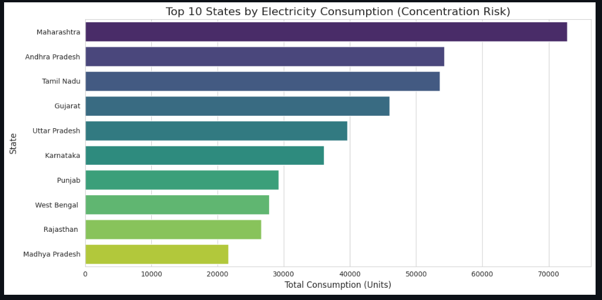
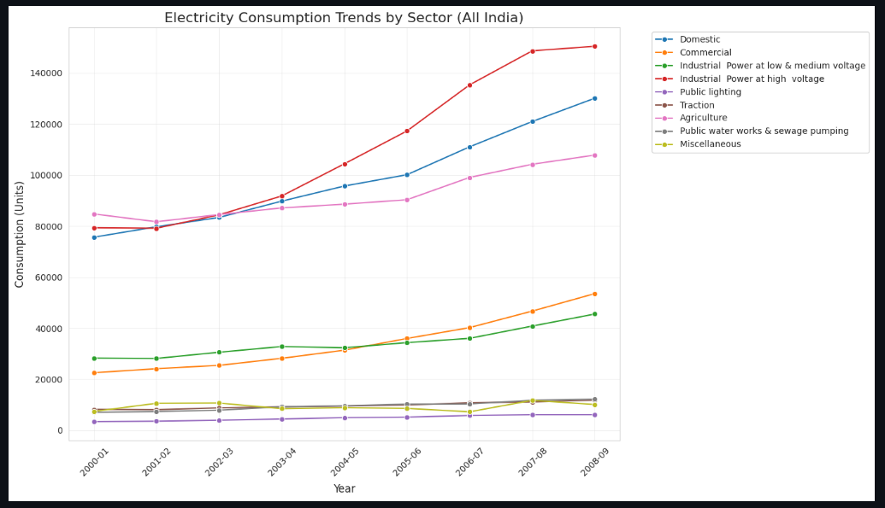
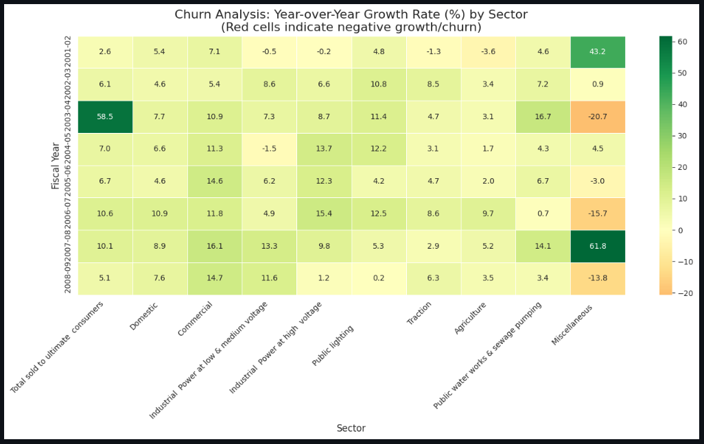

# Electricity Consumption & Churn Analysis

A comprehensive data analysis project investigating electricity consumption patterns and customer churn trends from 2000-2008.

## 📋 Project Overview

This project aims to analyze historical electricity consumption data and understand factors contributing to customer churn. The analysis pipeline includes data cleaning, exploratory data analysis (EDA), churn definition logic, and key performance indicators (KPIs).

## 📁 Project Structure

```
├── README.md                          # Project documentation
├── requirements.txt                   # Python dependencies
├── dashboards/                        # PowerBI dashboards
├── data/
│   ├── processed/
│   │   ├── datafile.csv
│   │   ├── powerbi_growth_data.csv
│   │   └── powerbi_state_data.csv
│   |   └── electricity_consumption_2000_2008.csv
│   └── raw/
├── notebooks/
│   ├── electricity_consumption_churn_analysis.ipynb
│   └── data/
│       └── processed/
├── reports/
│   └── executive_summary.md
└── visuals/
```

## 📊 Data Sources

- **Processed Data**: Cleaned and transformed CSV files ready for analysis
  - `datafile.csv`: Main processed dataset
  - `powerbi_growth_data.csv`: Data for growth analysis in PowerBI
  - `powerbi_state_data.csv`: State-wise data for PowerBI dashboards
  - `electricity_consumption_2000_2008.csv`: Electricity consumption data from 2000-2008

- **Raw Data**: Original Excel file (not included in repository)
  - `ELECTRICITY_SOLD_TO_ULTIMATE_CONSUMERS.xls`
  - Time period: 2000-2008 (8 years)
  - Source: Electricity consumption records
  - Format: Excel (.xls)

## 🔍 Notebooks

### **Electricity_Churn_Analysis.ipynb**
- Comprehensive analysis notebook covering data loading, cleaning, preprocessing, exploratory data analysis, and churn analysis
- Includes visualizations and insights on electricity consumption patterns

### **electricity_consumption_churn_analysis.ipynb**
- Basic data loading and initial processing from raw Excel data
- Extracts key columns for consumption analysis

## 🚀 Getting Started

### Prerequisites
- Python 3.12+
- pip

### Installation

1. **Clone the repository**
   ```bash
   git clone https://github.com/Sojwal27/Electricity_consumption_churn_analysis.git
   cd Electricity_consumption_churn_analysis
   ```

2. **Install dependencies**
   ```bash
   pip install -r requirements.txt
   ```

3. **Launch Jupyter Notebook**
   ```bash
   jupyter notebook
   ```

4. **Run notebooks**
   - Start with `Electricity_Churn_Analysis.ipynb` for comprehensive analysis
   - Alternatively, use `electricity_consumption_churn_analysis.ipynb` for basic data extraction

## 📦 Dependencies

All required packages are listed in `requirements.txt`:
- `pandas` - Data manipulation and analysis
- `numpy` - Numerical computing
- `plotly` - Interactive visualizations
- `xlrd` - Excel file support
- `jupyter` - Notebook environment

Install all dependencies:
```bash
pip install -r requirements.txt
```

## 📈 Key Findings

*To be updated after analysis completion*
## 📈 Visualizations

Here are key visualizations from the electricity consumption and churn analysis:

### Consumption Trends Over Time


### Sector-wise Consumption Distribution


### Churn Analysis by Sector


### Geographic Consumption Patterns

## � Dashboards

PowerBI dashboards for interactive visualization of electricity consumption patterns and churn analysis.

## 📋 Reports

- `executive_summary.md`: Executive summary with key findings, insights, and business recommendations.

## 📈 Visuals

Directory for storing generated visualizations, charts, and graphical outputs from the analysis.

## 🔄 Workflow

1. **Data Loading**: Load and explore electricity consumption datasets
2. **Data Cleaning**: Handle missing values, data type conversions, and preprocessing
3. **Exploratory Analysis**: Statistical summaries, trend analysis, and visualizations
4. **Churn Analysis**: Define churn metrics and identify patterns
5. **Insights & Reporting**: Generate KPIs, business insights, and recommendations
6. **Visualization**: Create dashboards and interactive reports

## 📝 Notes

- All data processing is documented in individual notebooks
- Each notebook is self-contained and can be executed independently
- Processed data is cached in CSV format for faster analysis
- All visualizations are interactive (Plotly)

## 👤 Author

Sojwal27

## 📄 License

This project is open source and available under the MIT License.

## 🤝 Contributing

Contributions are welcome! Please follow these steps:
1. Fork the repository
2. Create a feature branch (`git checkout -b feature/amazing-feature`)
3. Commit changes (`git commit -m 'Add amazing feature'`)
4. Push to branch (`git push origin feature/amazing-feature`)
5. Open a Pull Request

## 📧 Contact & Support

For questions or issues, please open a GitHub issue or contact the project maintainer.